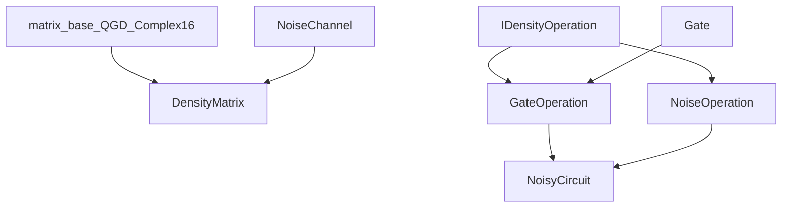

# Density Matrix Architecture

This document explains how the delivered density-matrix and partitioned-density
stack is structured today and where later Phase 4+ noisy VQE/VQA work will
attach.

Primary audience: contributors implementing or reviewing architecture changes.

## Design Principles

- Non-invasive foundation in phase 1:
  - new module integrated with build,
  - no behavior changes to existing state-vector paths.
- Reuse existing SQUANDER primitives where possible:
  - `matrix_base<QGD_Complex16>`,
  - existing `Gate` types through adapters.
- Keep C++/Python boundary thin:
  - pybind11 bindings expose C++ classes directly.

## Directory Layout

```text
squander/
  partitioning/
    noisy_planner.py
    noisy_runtime.py

  density_matrix/
    __init__.py
    bindings.cpp
    _density_matrix_cpp.*                # generated extension

  src-cpp/
    density_matrix/
      CMakeLists.txt
      density_matrix.cpp
      gate_operation.cpp
      noise_channel.cpp
      noise_operation.cpp
      noisy_circuit.cpp
      include/
        density_matrix.h
        density_operation.h
        gate_operation.h
        noise_channel.h
        noise_operation.h
        noisy_circuit.h
      tests/
        test_basic.cpp

benchmarks/
  density_matrix/
    correctness_evidence/
      validation_pipeline.py
    performance_evidence/
      validation_pipeline.py
    publication_evidence/
      validation_pipeline.py

tests/
  density_matrix/
    test_density_matrix.py
  partitioning/
    test_planner_surface_descriptors.py
    test_partitioned_runtime.py
    test_partitioned_runtime_fusion.py
```

## C++ Component Roles

- `DensityMatrix`
  - mixed-state container,
  - trace, purity, entropy, eigenvalues, validity checks,
  - local-kernel and full-unitary evolution,
  - partial trace.

- `IDensityOperation` (`density_operation.h`)
  - uniform operation interface:
    - `apply_to_density(...)`,
    - parameter count metadata,
    - clone support.

- `GateOperation`
  - adapter from existing `Gate*` to `IDensityOperation`,
  - enables reuse of existing gate classes.

- `NoiseOperation` hierarchy
  - operation-form noise channels used by `NoisyCircuit`.

- `NoiseChannel` hierarchy
  - legacy standalone noise API kept for compatibility.

- `NoisyCircuit`
  - owns ordered sequence of `IDensityOperation`,
  - tracks parameter offsets,
  - executes mixed gate/noise pipelines.

## C++ Class Relation Diagram



## Python Binding Layer

`squander/density_matrix/bindings.cpp` exposes:
- `DensityMatrix`,
- `NoisyCircuit`,
- `OperationInfo`,
- legacy noise channel classes.

The binding also handles:
- NumPy array conversion (`to_numpy`, `from_numpy`),
- overloaded noise insertion (`fixed` vs `parametric`).

## Build System Integration

Root `CMakeLists.txt`:
- defines shared `squander_common` INTERFACE target,
- includes `add_subdirectory(squander/src-cpp/density_matrix)`.

Module `CMakeLists.txt`:
- builds static `density_matrix_core`,
- builds pybind11 module `_density_matrix_cpp`,
- links against `qgd` and `squander_common`,
- supports optional C++ test executable.

## Delivered Phase 3 Integration Surfaces

- `squander/partitioning/noisy_planner.py`
  - defines the canonical noisy planner surface and schema-backed partition
    descriptor contract,
  - validates the supported Phase 3 gate/noise surface and structured
    unsupported behavior,
  - records provenance used by the correctness, performance, and publication
    evidence layers.
- `squander/partitioning/noisy_runtime.py`
  - executes validated descriptor sets in `partitioned_density` mode,
  - preserves audit-friendly partition and fused-region metadata,
  - provides the delivered conservative real fused path through
    descriptor-local unitary-island execution on eligible substructures.
- `NoisyCircuit`, `GateOperation`, and `NoiseOperation`
  - remain the exact mixed gate+noise execution contract,
  - provide the sequential reference path that the partitioned and fused runtime
    must preserve.
- `benchmarks/density_matrix/`
  - emits the machine-checkable correctness, performance, and
    publication-evidence bundles that back the bounded Phase 3 methods claim.

## Phase 4+ Extension Points

- `qgd_Circuit` / `Gates_block` integration boundary
  - broadens circuit-source support beyond the delivered Phase 3 lowering paths,
  - remains the main place to grow beyond the current bounded support surface.
- `squander/src-cpp/decomposition/Variational_Quantum_Eigensolver_Base.cpp`
  - broaden circuit-source support beyond the frozen Phase 2 workflow,
  - connect later noisy VQE/VQA features to the Phase 3 backend.
- `squander/VQA/qgd_Variational_Quantum_Eigensolver_Base.py`
  - expose additional noisy VQE/VQA controls after the Phase 3 backend contract
    stabilizes.
- `squander/src-cpp/decomposition/Optimization_Interface.cpp`
  - route gradient and optimizer flows for the broader Phase 4 density-backend
    surface.

Secondary follow-on targets:
- `noisy_circuit.cpp` for richer noise insertion and partition-runtime hooks,
- `density_matrix.cpp` for optional, benchmark-driven AVX-level kernel
  acceleration only if profiling shows that it materially supports the
  mixed-state partition/fusion path.

## Architectural Trade-offs

- Current split (`NoiseOperation` + `NoiseChannel`) preserves compatibility but
  duplicates some channel logic; Phase 3 brought the effective noise behavior
  into the planner/runtime contract, but channel-native fused noisy blocks
  remain deferred.
- Direct pybind11 exposure gives clear performance behavior but keeps API close
  to C++ conventions (less Python sugar).
- Reusing the existing state-vector partitioning assets is attractive, but
  the delivered Phase 3 surface remains intentionally bounded rather than full
  `qgd_Circuit` parity across every source path.
- The sequential `NoisyCircuit` executor remains the required exact baseline
  even after the partitioned runtime was added.
- The current fused baseline is intentionally conservative: descriptor-local
  unitary-island fusion provides real fused execution without yet claiming
  universal speedups or a general channel-native noisy-block architecture.

