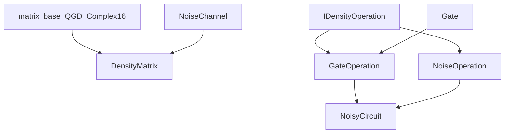

# Density Matrix Architecture

This document explains how the density matrix module is structured today and
where later-phase deep integration work, especially Phase 3 noise-aware
partitioning/fusion and Phase 4+ broader noisy VQE/VQA support, will attach.

Primary audience: contributors implementing or reviewing architecture changes.

## Design Principles

- Non-invasive foundation in phase 1:
  - new module integrated with build,
  - no behavior changes to existing state-vector paths.
- Reuse existing SQUANDER primitives where possible:
  - `matrix_base<QGD_Complex16>`,
  - existing `Gate` types through adapters.
- Keep C++/Python boundary thin:
  - pybind11 bindings expose C++ classes directly.

## Directory Layout

```text
squander/
  density_matrix/
    __init__.py
    bindings.cpp
    _density_matrix_cpp.*                # generated extension

  src-cpp/
    density_matrix/
      CMakeLists.txt
      density_matrix.cpp
      gate_operation.cpp
      noise_channel.cpp
      noise_operation.cpp
      noisy_circuit.cpp
      include/
        density_matrix.h
        density_operation.h
        gate_operation.h
        noise_channel.h
        noise_operation.h
        noisy_circuit.h
      tests/
        test_basic.cpp

tests/
  density_matrix/
    test_density_matrix.py
```

## C++ Component Roles

- `DensityMatrix`
  - mixed-state container,
  - trace, purity, entropy, eigenvalues, validity checks,
  - local-kernel and full-unitary evolution,
  - partial trace.

- `IDensityOperation` (`density_operation.h`)
  - uniform operation interface:
    - `apply_to_density(...)`,
    - parameter count metadata,
    - clone support.

- `GateOperation`
  - adapter from existing `Gate*` to `IDensityOperation`,
  - enables reuse of existing gate classes.

- `NoiseOperation` hierarchy
  - operation-form noise channels used by `NoisyCircuit`.

- `NoiseChannel` hierarchy
  - legacy standalone noise API kept for compatibility.

- `NoisyCircuit`
  - owns ordered sequence of `IDensityOperation`,
  - tracks parameter offsets,
  - executes mixed gate/noise pipelines.

## C++ Class Relation Diagram



## Python Binding Layer

`squander/density_matrix/bindings.cpp` exposes:
- `DensityMatrix`,
- `NoisyCircuit`,
- `OperationInfo`,
- legacy noise channel classes.

The binding also handles:
- NumPy array conversion (`to_numpy`, `from_numpy`),
- overloaded noise insertion (`fixed` vs `parametric`).

## Build System Integration

Root `CMakeLists.txt`:
- defines shared `squander_common` INTERFACE target,
- includes `add_subdirectory(squander/src-cpp/density_matrix)`.

Module `CMakeLists.txt`:
- builds static `density_matrix_core`,
- builds pybind11 module `_density_matrix_cpp`,
- links against `qgd` and `squander_common`,
- supports optional C++ test executable.

## Deep Integration Extension Points (Phases 3-5)

Primary Phase 3 targets:
- `squander/partitioning` and related planner utilities
  - accept noisy mixed-state circuits as first-class planner inputs,
  - carry noise placement/channel metadata and density-matrix execution
    semantics into partition decisions.
- `qgd_Circuit` / `Gates_block` integration boundary
  - adapt existing fusion/runtime machinery so partitions extracted from noisy
    circuits do not assume a unitary-only contract,
  - provide at least one executable fused-block path for eligible
    substructures inside the noisy-circuit runtime.
- `NoisyCircuit`, `GateOperation`, and `NoiseOperation`
  - provide the exact mixed gate+noise execution contract that any partitioned
    or fused runtime must preserve,
  - without requiring the minimum Phase 3 result to already implement
    channel-native fused noisy blocks.

Primary Phase 4+ targets:
- `squander/src-cpp/decomposition/Variational_Quantum_Eigensolver_Base.cpp`
  - broaden circuit-source support beyond the frozen Phase 2 workflow,
  - connect later noisy VQE/VQA features to the Phase 3 backend.
- `squander/VQA/qgd_Variational_Quantum_Eigensolver_Base.py`
  - expose additional noisy VQE/VQA controls after the Phase 3 backend contract
    stabilizes.
- `squander/src-cpp/decomposition/Optimization_Interface.cpp`
  - route gradient and optimizer flows for the broader Phase 4 density-backend
    surface.

Secondary extension targets:
- `noisy_circuit.cpp` for richer noise insertion and partition-runtime hooks,
- `density_matrix.cpp` for optional, benchmark-driven AVX-level kernel
  acceleration only if profiling shows that it materially supports the
  mixed-state partition/fusion path.

## Architectural Trade-offs

- Current split (`NoiseOperation` + `NoiseChannel`) preserves compatibility but
  duplicates some channel logic; Phase 3 must still make the effective noise
  behavior visible to partition planning rather than leaving it as out-of-band
  execution detail.
- Direct pybind11 exposure gives clear performance behavior but keeps API close
  to C++ conventions (less Python sugar).
- Reusing the existing state-vector partitioning assets is attractive, but
  Phase 3 cannot assume noise only exists at partition boundaries.
- Non-invasive phase 1 reduced migration risk; Phase 2 completed the minimum
  noisy-workflow integration, and the next major integration step now moves into
  partitioning/fusion before broader Phase 4 VQE/VQA growth.

