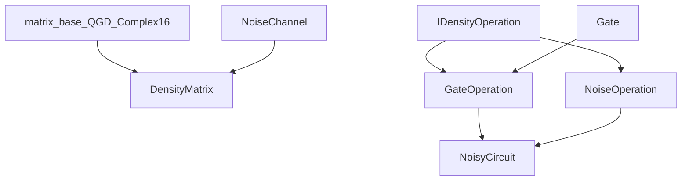

# Density Matrix Architecture

This document describes how the density-matrix stack is structured today: core
simulation, workflow integration, noise-aware partitioning and runtime, evidence
pipelines, and where future work attaches. It avoids milestone numbering; for
delivery history and roadmap wording, see `CHANGELOG.md` and `README.md`.

## Design principles

- **Non-invasive foundation:** the mixed-state backend is an added module with
its own CMake target and Python package. Default variational workflows remain
state-vector unless the caller selects the density path explicitly.
- **Reuse SQUANDER primitives** where practical: `matrix_base<QGD_Complex16>`,
existing `Gate` types through adapters on the circuit path.
- **Thin C++/Python boundary:** pybind11 exposes core C++ types directly; higher-level
contracts (planner, partitioned runtime) live in Python for schema evolution
and audit records.

## High-level component map


| Layer                                | Responsibility                                                                                                                                                                                                                                   |
| ------------------------------------ | ------------------------------------------------------------------------------------------------------------------------------------------------------------------------------------------------------------------------------------------------ |
| **C++ density module**               | Exact dense `DensityMatrix` state, ordered gate+noise execution via `NoisyCircuit`, operation adapters, legacy standalone noise channels.                                                                                                        |
| **Python `squander.density_matrix`** | Bindings to the C++ module: `DensityMatrix`, `NoisyCircuit`, `OperationInfo`, noise channel classes, NumPy interop.                                                                                                                              |
| **Variational integration**          | `qgd_Variational_Quantum_Eigensolver_Base` (C++ core + Python façade): optional density backend, ordered fixed local-noise specification, bridge metadata for downstream tools.                                                                  |
| **Partitioning (noisy)**             | `noisy_planner.py`: canonical mixed-state operation surface, validation, partition descriptors (remap + parameter routing). `noisy_runtime.py`: executable partitioned execution and conservative unitary-island fusion vs sequential reference. |
| **State-vector partitioning**        | `squander/partitioning/*.py` (e.g. Kahn, TDAG, ILP): mature for `qgd_Circuit`-style workloads; the noisy planner/runtime form a **parallel** contract aimed at mixed-state semantics rather than replacing that stack wholesale.                 |
| **Evidence and benchmarks**          | `benchmarks/density_matrix/`: workflow validation, planner/runtime correctness, performance narratives, publication-facing manifests and checkers.                                                                                               |
| **Tests**                            | `tests/density_matrix/`, `tests/partitioning/`: Python and optional C++ tests aligned with the above.                                                                                                                                            |


## Directory layout

```text
squander/
  VQA/
    qgd_Variational_Quantum_Eigensolver_Base.py   # backend + density_noise + bridge API

  partitioning/
    noisy_planner.py
    noisy_runtime.py
    kahn.py, tdag.py, ilp.py, partition.py, tools.py   # state-vector-oriented planners

  density_matrix/
    __init__.py
    bindings.cpp
    _density_matrix_cpp.*                # generated extension

  src-cpp/
    density_matrix/
      CMakeLists.txt
      density_matrix.cpp
      gate_operation.cpp
      noise_channel.cpp
      noise_operation.cpp
      noisy_circuit.cpp
      include/
        density_matrix.h
        density_operation.h
        gate_operation.h
        noise_channel.h
        noise_operation.h
        noisy_circuit.h
      tests/
        test_basic.cpp
    variational_quantum_eigensolver/     # VQE base: density path, bridge, noise hooks

benchmarks/
  density_matrix/
    workflow_evidence/
    partitioned_runtime/
    planner_surface/
    correctness_evidence/
    performance_evidence/
    publication_evidence/
    ...

tests/
  density_matrix/
    test_density_matrix.py
  partitioning/
    test_planner_surface_*.py
    test_partitioned_runtime.py
    test_partitioned_runtime_fusion.py
```

Root `CMakeLists.txt` pulls in `squander/src-cpp/density_matrix` via
`squander_common` and builds the pybind11 extension linked against the rest of
the C++ tree.

## C++ component roles (density module)

- `**DensityMatrix**` — Mixed-state container: trace, purity, entropy,
eigenvalues, validity checks, local-kernel and full-unitary evolution,
partial trace, local multi-qubit unitary application (used by fusion paths).
- `**IDensityOperation**` (`density_operation.h`) — Uniform operation interface:
`apply_to_density`, parameter metadata, cloning.
- `**GateOperation**` — Adapts existing `Gate*` to `IDensityOperation` so gate
definitions stay centralized.
- `**NoiseOperation` hierarchy** — Channel instances in the **circuit** execution
model (ordered with gates in `NoisyCircuit`).
- `**NoiseChannel` hierarchy** — Standalone “apply to existing ρ” API kept for
compatibility and simple scripts.
- `**NoisyCircuit`** — Owns an ordered list of `IDensityOperation`, tracks
parameter offsets, runs mixed gate/noise pipelines sequentially. This executor
is the **exact semantic baseline** against which partitioned and fused paths
are validated.

## C++ class relation (density core)




## Python binding layer

`squander/density_matrix/bindings.cpp` exposes `DensityMatrix`, `NoisyCircuit`,
`OperationInfo`, and legacy noise classes. It handles NumPy conversion and
overloads for fixed vs parametric noise insertion on the circuit API.

## Variational integration (density path)

The VQE base class (C++ `Variational_Quantum_Eigensolver_Base` and Python
`qgd_Variational_Quantum_Eigensolver_Base`) implements:

- **Backend selection** — State vector (default) vs density matrix. The density
path is **strict**: unsupported circuit sources, gate sets, or optimizer modes
fail with explicit errors rather than falling back.
- **Ordered fixed local noise** — Configuration for insertions after chosen gate
indices (local depolarizing, amplitude damping, phase damping vocabulary on the
supported workflow surface).
- **Bridge metadata** — `describe_density_bridge()` (and C++ counterpart)
returns a structured description of the lowered gate/noise sequence for audits
and for handoff into the noisy planner.

The intended **scientific** role of this layer is exact noisy energy evaluation
(Re Tr(Hρ) with the sparse Hamiltonian) on the **documented** support surface,
not arbitrary hand-built circuits.

## Noisy planner and partitioned runtime (Python)

- `**noisy_planner.py`** — Builds and validates a **canonical** ordered list of
gate and noise operations (schema-versioned), generates **partition
descriptors** that preserve order, noise placement, global↔local qubit remapping,
and **parameter routing** segments. Emits audit-friendly dicts; raises
structured validation errors for unsupported requests.
- `**noisy_runtime.py`** — Consumes validated descriptor sets in partitioned
mode: per-partition `NoisyCircuit` construction with routed parameters,
execution on a single global `DensityMatrix`, optional **descriptor-local
unitary-island fusion** (real fused kernels on small eligible unitary runs),
and `**execute_sequential_density_reference`** to flatten the same semantics
into one circuit for bitwise checks. Records runtime path, partition/fusion
records, timing, and RSS for evidence scripts.

Together, these modules make mixed-state circuits **first-class inputs** to
planning and execution, not noise folded only into informal metadata.

## Evidence pipelines

Under `benchmarks/density_matrix/`, separate trees maintain workflow validation
(vs external simulators where required), partitioned-runtime correctness,
performance summaries, and publication-oriented manifest validation. These are
the machine-checkable counterparts to architectural claims about exactness and
bounded support.

## Extension points (future work)

The following are the main **attachment surfaces** for broader capabilities; they
are not promises of immediate implementation:


| Area                     | Extension idea                                                                                                                                                           |
| ------------------------ | ------------------------------------------------------------------------------------------------------------------------------------------------------------------------ |
| **Circuit sources**      | Broaden lowering from `qgd_Circuit` / `Gates_block` and custom structures into the canonical noisy surface beyond today’s audited routes.                                |
| **VQE/VQA surface**      | Widen which ansätze, optimizers, and gradient paths are allowed on the density backend; route optimizer callbacks through `Optimization_Interface` when gradients exist. |
| **Python VQE façade**    | Additional knobs and reporting once the C++ contract for broader workflows stabilizes.                                                                                   |
| **Noise model**          | Richer channels, parametric noise programs, or channel-native fused blocks in `noisy_circuit.cpp` / `noise_operation` if benchmarked and semantics-preserving.           |
| **Kernels**              | Optional SIMD or memory-layout work in `density_matrix.cpp` if profiling shows it dominates after Python and fusion overhead are addressed.                              |
| **Planner cost model**   | Deeper integration with or replacement of span-budget heuristics using density-aware costs; optional ties to the existing state-vector partitioners for comparison only. |
| **Trainability science** | Higher-level experiment runners (gradients variance, entropies, barren-plateau diagnostics) consuming the same exact backend.                                            |


Secondary hooks: partition-runtime internals may grow additional fusion classes;
planner schemas may version forward while keeping validation strict.

## Architectural trade-offs (current state)

- **Exactness vs scale** — Dense exact density matrices scale exponentially in
qubit count. The stack commits to **exact** simulation on the supported
surfaces; acceleration is additive (partitioning, limited fusion) and must
match the sequential `NoisyCircuit` reference within defined tolerances.
- `Two noise representations — NoiseOperation (in-circuit) vs legacy
NoiseChannel (standalone) keeps compatibility but duplicates some logic. The
planner/runtime contract aligns behavioral truth with the circuit-ordered
model; a unified channel-only story would be a larger refactor.`
- **Python vs C++ for planning** — Schema-heavy planner and descriptor logic in
Python speeds iteration and audit JSON emission; hot evolution remains in C++.
Fused paths that call back into NumPy-built kernels can add overhead; current
performance closure is **diagnosis-oriented** (where time goes) rather than a
blanket speedup claim.
- **Bounded support surface** — Gate and noise names, workflow sources, and
optimizer modes are **intentionally restricted** so validation and papers
stay auditable. Full parity with every `qgd_Circuit` feature and every
state-vector partitioner variant is explicitly **out of scope** for the
delivered noisy partition contract until extended through the table above.
- **Conservative fusion** — Unitary-island fusion is real and exact on eligible
substructures but does not replace a general superoperator or Kraus fusion
architecture for arbitrary noisy subcircuits.
- **pybind11 style** — Direct exposure preserves performance and fidelity to C++
naming; Python ergonomics are thinner than a pure-Python simulator would be.
- **Relationship to state-vector partitioning** — The mature partitioners
remain the natural place for ideal-circuit cost optimization. The noisy
planner/runtime are a **separate** track governed by mixed-state semantics;
reusing their algorithms as heuristics is possible, but the cost models and
admissibility rules are not assumed identical.

---

For setup and build, see `SETUP.md`. For callable API details, see the reference
documents under `docs/density_matrix_project/phases/` (core density module and
the guide that covers variational integration plus noisy partitioning).