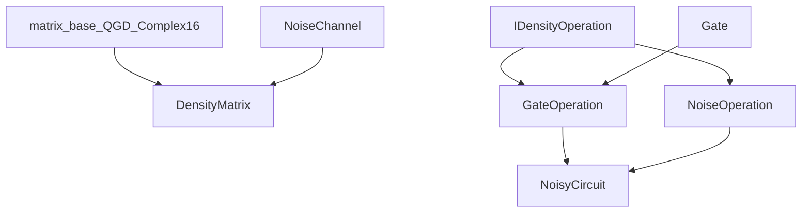

# Density Matrix Architecture

This document explains how the density matrix module is structured today and
where deep integration work (Phases 2-5) will attach.

Primary audience: contributors implementing or reviewing architecture changes.

## Design Principles

- Non-invasive foundation in phase 1:
  - new module integrated with build,
  - no behavior changes to existing state-vector paths.
- Reuse existing SQUANDER primitives where possible:
  - `matrix_base<QGD_Complex16>`,
  - existing `Gate` types through adapters.
- Keep C++/Python boundary thin:
  - pybind11 bindings expose C++ classes directly.

## Directory Layout

```text
squander/
  density_matrix/
    __init__.py
    bindings.cpp
    _density_matrix_cpp.*                # generated extension

  src-cpp/
    density_matrix/
      CMakeLists.txt
      density_matrix.cpp
      gate_operation.cpp
      noise_channel.cpp
      noise_operation.cpp
      noisy_circuit.cpp
      include/
        density_matrix.h
        density_operation.h
        gate_operation.h
        noise_channel.h
        noise_operation.h
        noisy_circuit.h
      tests/
        test_basic.cpp

tests/
  density_matrix/
    test_density_matrix.py
```

## C++ Component Roles

- `DensityMatrix`
  - mixed-state container,
  - trace, purity, entropy, eigenvalues, validity checks,
  - local-kernel and full-unitary evolution,
  - partial trace.

- `IDensityOperation` (`density_operation.h`)
  - uniform operation interface:
    - `apply_to_density(...)`,
    - parameter count metadata,
    - clone support.

- `GateOperation`
  - adapter from existing `Gate*` to `IDensityOperation`,
  - enables reuse of existing gate classes.

- `NoiseOperation` hierarchy
  - operation-form noise channels used by `NoisyCircuit`.

- `NoiseChannel` hierarchy
  - legacy standalone noise API kept for compatibility.

- `NoisyCircuit`
  - owns ordered sequence of `IDensityOperation`,
  - tracks parameter offsets,
  - executes mixed gate/noise pipelines.

## C++ Class Relation Diagram



## Python Binding Layer

`squander/density_matrix/bindings.cpp` exposes:
- `DensityMatrix`,
- `NoisyCircuit`,
- `OperationInfo`,
- legacy noise channel classes.

The binding also handles:
- NumPy array conversion (`to_numpy`, `from_numpy`),
- overloaded noise insertion (`fixed` vs `parametric`).

## Build System Integration

Root `CMakeLists.txt`:
- defines shared `squander_common` INTERFACE target,
- includes `add_subdirectory(squander/src-cpp/density_matrix)`.

Module `CMakeLists.txt`:
- builds static `density_matrix_core`,
- builds pybind11 module `_density_matrix_cpp`,
- links against `qgd` and `squander_common`,
- supports optional C++ test executable.

## Deep Integration Extension Points (Phases 2-5)

Primary integration targets:
- `squander/src-cpp/decomposition/Variational_Quantum_Eigensolver_Base.cpp`
  - add density-matrix backend path,
  - support expectation value `Tr(H*rho)`.
- `squander/VQA/qgd_Variational_Quantum_Eigensolver_Base.py`
  - expose backend selection and noisy VQA controls.
- `squander/src-cpp/decomposition/Optimization_Interface.cpp`
  - route gradient and optimizer flows for density backend.

Secondary extension targets:
- `noisy_circuit.cpp` for richer noise insertion and calibration-aware models,
- `density_matrix.cpp` for AVX-level kernel acceleration in later phases.

## Architectural Trade-offs

- Current split (`NoiseOperation` + `NoiseChannel`) preserves compatibility but
  duplicates some channel logic.
- Direct pybind11 exposure gives clear performance behavior but keeps API close
  to C++ conventions (less Python sugar).
- Non-invasive phase 1 reduced migration risk; phase 2+ intentionally increases
  integration depth to support noisy VQA workflows.

