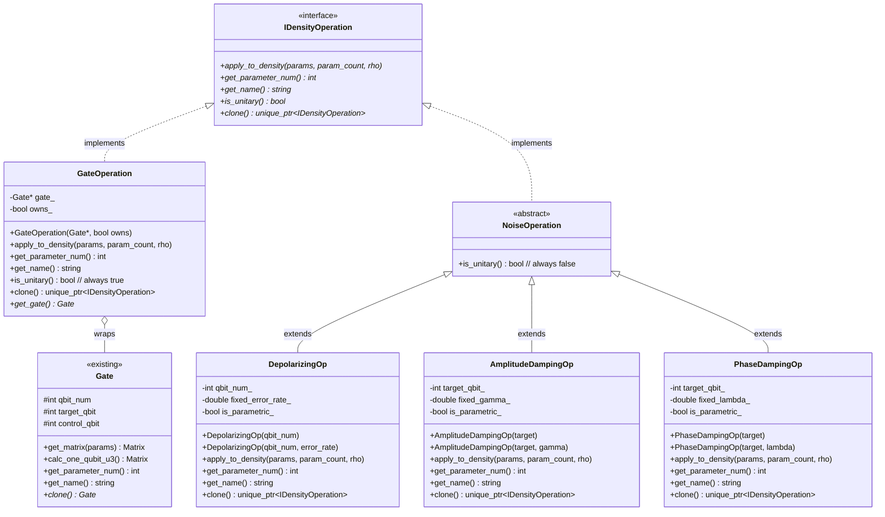
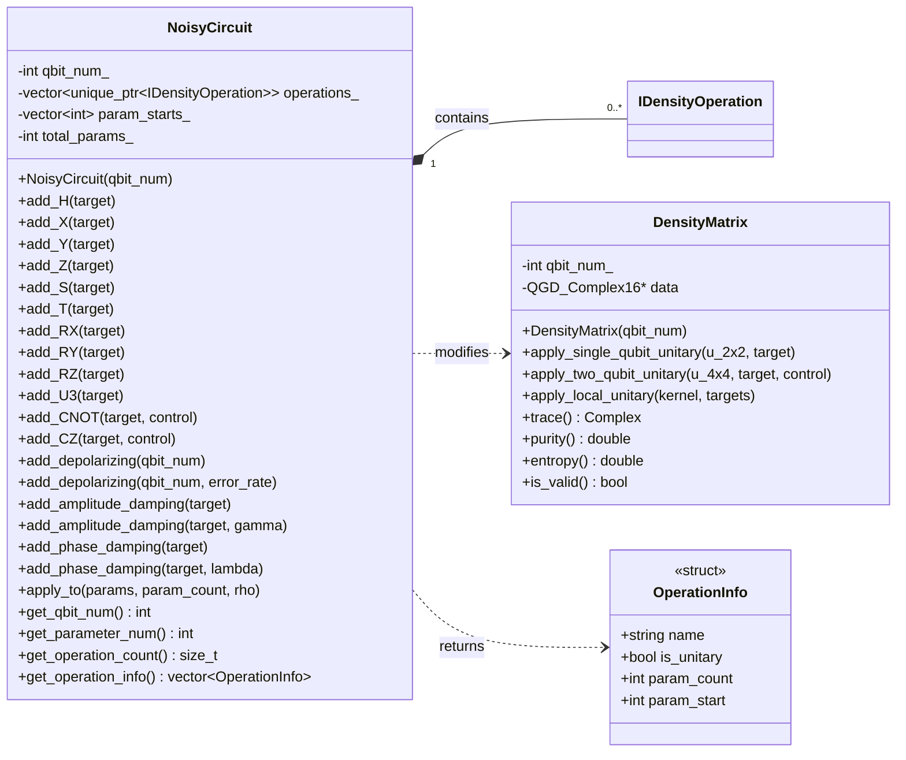
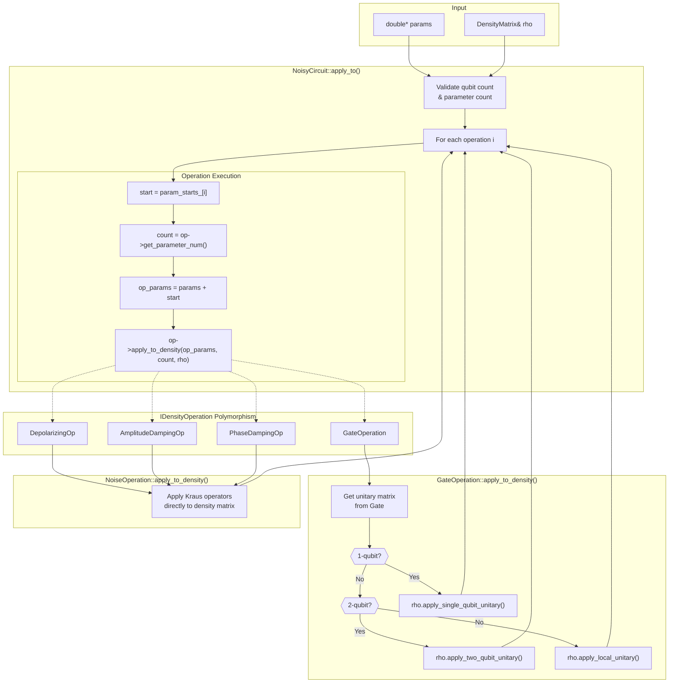
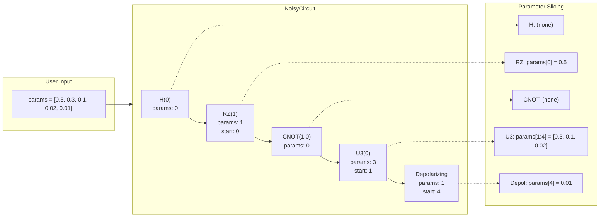
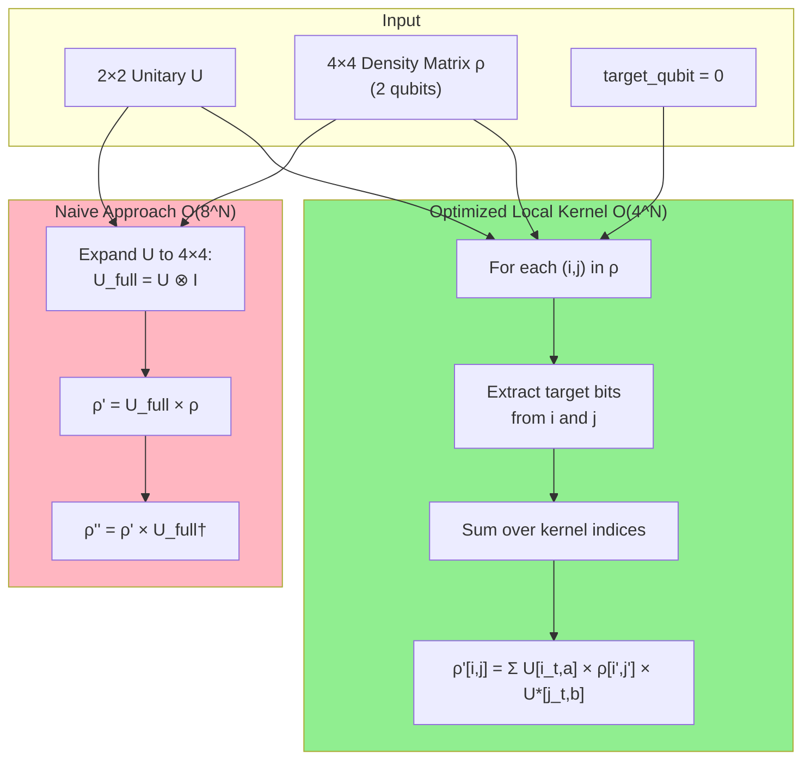
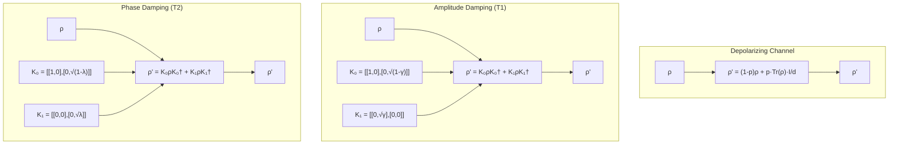
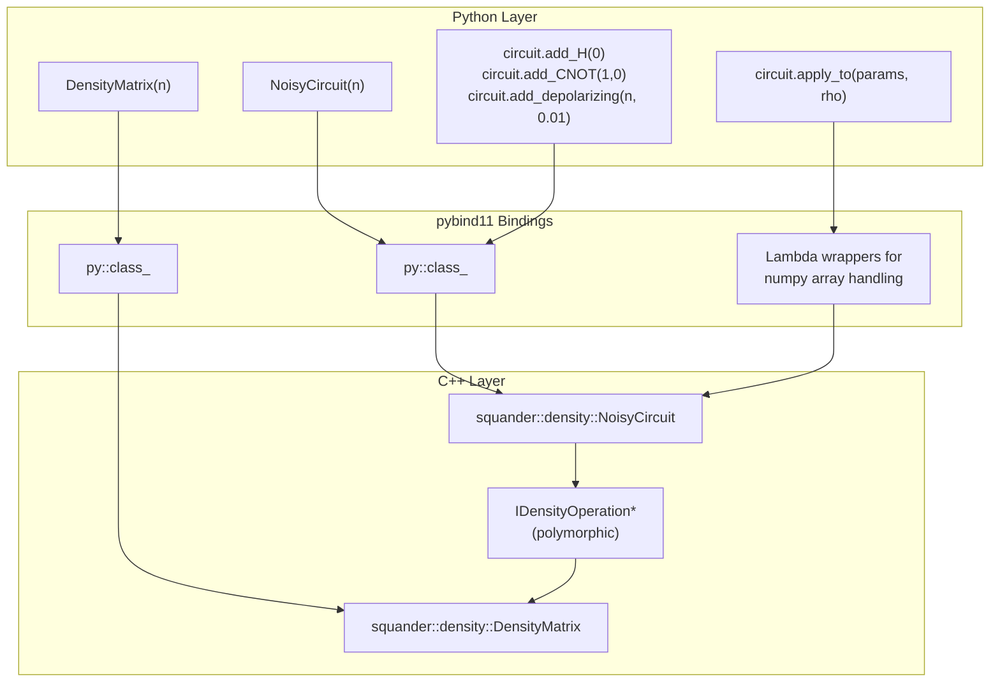
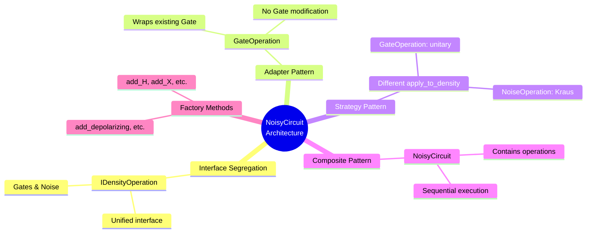
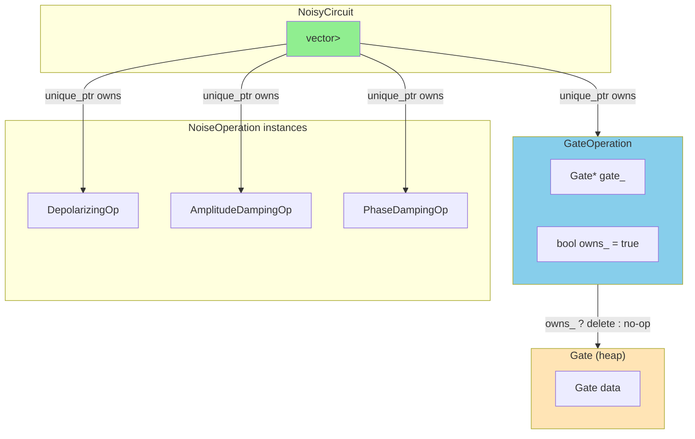

# NoisyCircuit Architecture - Mermaid Diagrams

## 1. Class Hierarchy

## 2. NoisyCircuit Structure

## 3. Circuit Execution Flow

## 4. Parameter Flow

## 5. Density Matrix Local Unitary Application

## 6. Noise Channel Mathematics

## 7. Python Binding Architecture

## 8. Design Patterns Used

## 9. Memory Ownership

---

## Quick Reference

| Component | Purpose | Key Method |
|-----------|---------|------------|
| `IDensityOperation` | Interface for all operations | `apply_to_density()` |
| `GateOperation` | Adapts Gate → IDensityOperation | Calls `apply_local_unitary()` |
| `NoiseOperation` | Base for noise channels | `is_unitary() = false` |
| `DepolarizingOp` | Global depolarizing noise | Direct density modification |
| `AmplitudeDampingOp` | T1 relaxation | Kraus operators |
| `PhaseDampingOp` | T2 dephasing | Kraus operators |
| `NoisyCircuit` | Orchestrates execution | `apply_to()` |
| `DensityMatrix` | Quantum state | `apply_single/two_qubit_unitary()` |

